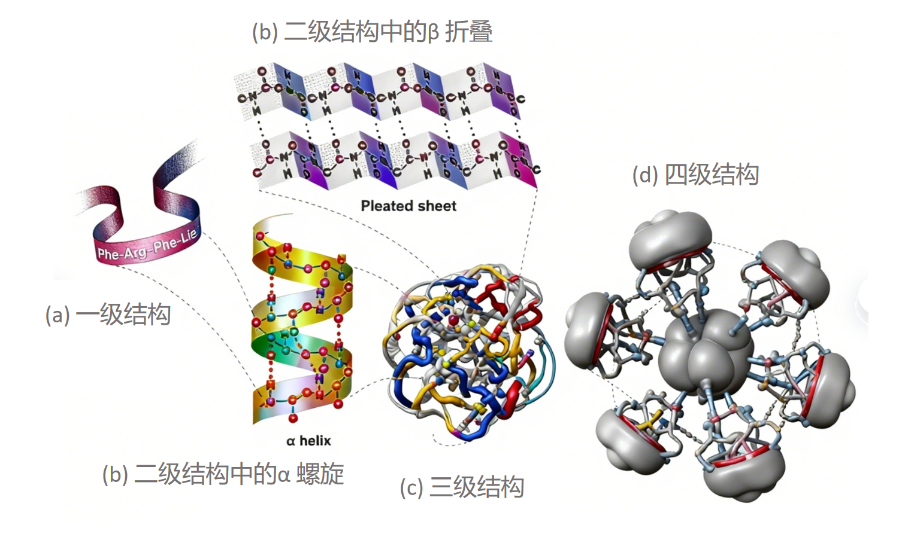

# 第一章 概述：结构蛋白质组学

## 1.1 课程情况
**结构蛋白质组学**是蛋白质组学的核心分支之一，核心目标是通过**实验测定**与**理论计算**相结合的方式，系统解析蛋白质的空间结构、探索其动态构象变化，最终实现对蛋白质结构信息的全面认知。
 
本课程将围绕这一核心展开，为对这方面感兴趣的同学或初学者或相关方向研究者搭建了完整的学习框架，不仅仅提供基础理论知识的学习，还融入一定的实战练习和前沿同步分享，为后续深入研究/学习提供支撑。

## 1.2 蛋白质的主要生物学功能
蛋白质的生物学功能是其结构的直接体现，核心功能贯穿生命活动的关键环节，且均依赖特定的结构基础：
1.  **催化功能：**
    酶通过活性中心的精确三维构象识别底物，加速生化反应，其结构稳定性决定催化效率；

2.  **结构支持功能：**
    胶原蛋白、微管蛋白等通过特定聚合方式形成细胞骨架或组织支架，结构的力学特性支撑机体形态；

3.  **信号转导功能：**
    膜受体蛋白通过构象变化传递胞外信号，跨膜结构与胞内结构域的协同作用保障信号通路通畅；

4.  **运输与储存功能：**
    血红蛋白等通过四级结构的别构效应实现物质的高效结合与释放，结构的动态变化适配生理需求。
    
此外，蛋白质还参与分子识别（抗体-抗原相互作用）、运动功能（肌球蛋白）、基因调控（转录因子）等过程。这种功能多样性的来源主要包括：

- 氨基酸**侧链**化学性质的多样性：20种标准氨基酸的侧链具有不同的尺寸、电荷、极性和反应性
- 多肽链的**构象**柔韧性：主链二面角允许多肽链采取多种构象
- 多样的**折叠方式**：不同的氨基酸序列通过不同的途径折叠成独特的三维结构

## 1.3 蛋白质的结构层次体系
蛋白质的结构具有清晰的层次化特征，各级结构既相互独立又紧密关联，共同支撑起蛋白质的空间特征与生物学活性基础。同时，每一级结构均由特定的化学作用力与空间约束所维系（更多内容可见第X章）。

1.  **一级结构:** 氨基酸的线性序列，由基因编码决定。包含蛋白质折叠所需的全部信息。序列比对工具（**BLAST**、**Clustal Omega**）可用于评估序列保守性和同源性。
    - BLAST：[https://blast.ncbi.nlm.nih.gov/Blast.cgi](https://blast.ncbi.nlm.nih.gov/Blast.cgi)
    - Clustal Omega：[http://www.clustal.org/omega/#Webservers](http://www.clustal.org/omega/#Webservers)

2.  **二级结构:** 多肽链**局部区域**的规则构象，主要包括α-螺旋、β-折叠、β-转角和无规卷曲。它们都是通过多肽主链（backbone）氨基酸上恒定部分的N-H和C==O基团之间有规律的氢键相互作用形成的。
    二级结构评估工具：**DSSP**、**STRIDE**、**PSIPRED**。

3.  **三级结构:** 单条多肽链在三维空间中的整体折叠，包括所有主链和侧链原子的空间排列，并通过疏水作用、氢键、二硫键等作用进行稳定。
    三级结构评估工具：**MolProbity**、**PROSESS**、**Verify3D**。

4.  **四级结构:** 多条具有独立三级结构的多肽链（亚基）通过非共价相互作用形成的寡聚体结构。如血红蛋白α₂β₂四聚体。
    四级结构评估工具：**PISA**、**COCOMAPS**、**PRODIGY**。

<!-- VitePress 图片居中+尺寸优化 -->

  
  
图1 蛋白质结构层次

 

## 1.4 （补充）表达、功能蛋白质组学
**蛋白质组学**包含三大分支，结构蛋白质组学与另外两个分支相互补充、协同构成完整的研究体系：
1.  **表达蛋白质组学**
    又称高通量蛋白质组学，核心是在大规模水平上鉴定蛋白质的表达状态与表达丰度，主要采用 “自底向上”（鸟枪法）和 “自顶向下” 两种质谱策略，实现蛋白质的定性与定量分析；

2.  **功能蛋白质组学**
    聚焦蛋白质的功能及其相互作用，针对特定蛋白质组开展研究，可提供翻译后修饰、信号转导通路、蛋白质 - 药物相互作用等关键信息，为结构与功能的关联分析提供依据。

三者分别从 "是否表达" "如何发挥功能" "具有怎样的结构" 三个维度切入，共同支撑对蛋白质组的全面研究。
