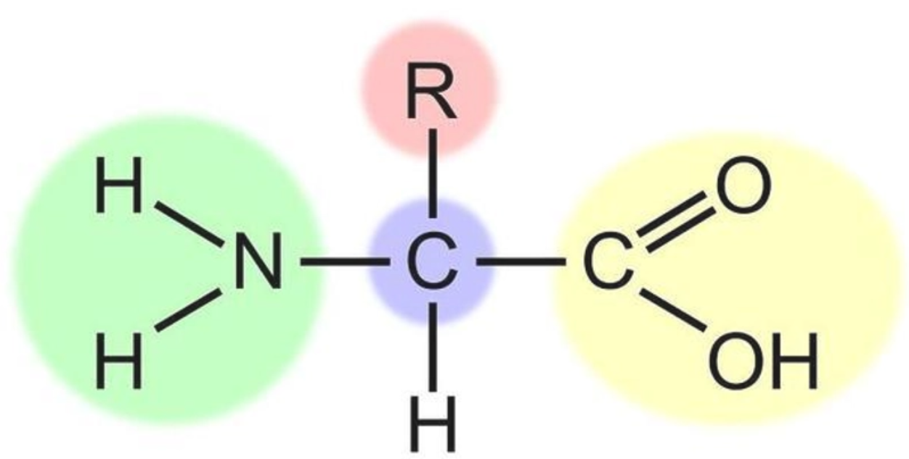
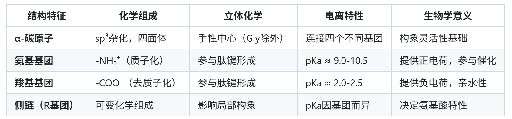

# 第二章 氨基酸的基本化学单元与连接

## 2.1 氨基酸的基本化学结构
氨基酸是蛋白质的**基本结构单元**，其分子结构具有高度保守的特征模式。所有蛋白质氨基酸都遵循相同的通用结构模板：一个中心**α-碳原子（Cα）** 共价连接四个不同的基团——**氨基基团（-NH₂）**、**羧基基团（-COOH）**、**氢原子（-H）** 和特异性**侧链基团（-R）**。除侧链仅为氢原子的甘氨酸外，其余氨基酸的α‑碳原子均为手性碳原子，使氨基酸具有立体异构特性。

<!-- VitePress 图片居中+样式优化 -->

  
  
图1 氨基酸结构通式

天然蛋白质中的氨基酸几乎均为L‑型构型，这是生物进化过程中形成的保守特征；D‑型氨基酸极少出现在常规蛋白质中，仅存在于部分微生物细胞壁、特殊短肽等特例结构中。氨基酸的立体构型具有严格的空间取向，直接影响后续肽链折叠方式与蛋白质整体空间构象，是结构蛋白质组学进行结构建模与解析的重要基础。

  
  
表1：蛋白质氨基酸的通用结构和特性

在生理 pH（约 7.4）环境下，氨基酸的氨基会发生质子化形成 −NH₃⁺，羧基发生解离形成 −COO⁻，使氨基酸以 ** 两性离子（兼性离子）** 形式存在。这种带电特性决定了氨基酸的溶解性、静电相互作用能力，也是驱动蛋白质折叠、维持结构稳定的关键化学基础。

## 2.2 氨基酸分子内的键长与键角
氨基酸分子内部的键长与键角是决定其空间尺度、构象刚性与柔性的核心参数，也是肽链乃至蛋白质高级结构形成的微观结构基础，在结构蛋白质组学的高精度结构计算与建模中具有重要意义。

氨基酸分子内存在多种稳定的共价键，其键长具有高度保守性：α‑碳与羧基碳（Cα−C）键长约 1.51 Å，α‑碳与氮原子（Cα−N）键长约 1.45 Å，羧基中的羰基双键（C=O）约 1.23 Å，氨基中的氮氢键（N−H）约 1.01 Å。稳定的键长保证了氨基酸主链的尺度均一性，为肽链规则构象的形成提供了结构前提。

从键角与空间构型来看，α‑碳原子采取 sp³ 杂化，呈现标准的四面体构型，键角接近 109.5°。氨基酸主链上的单键在无空间位阻时可发生自由旋转，赋予分子一定的构象自由度；而侧链 R‑基的体积、电荷与刚性会直接限制旋转能力，产生空间位阻效应。

氨基酸的键参数不仅决定自身空间形态，更直接为后续肽链二面角（φ/ψ）的形成与限制提供基础，是理解蛋白质主链构象、二级结构特征的前置知识点。

## 2.3 肽键与脱水缩合
氨基酸之间通过特定的共价连接方式形成肽链，这一过程是蛋白质一级结构的构建基础，而连接氨基酸的肽键，其化学与结构特性直接决定肽链主链的构象规则，是结构蛋白质组学的核心化学基础之一。

氨基酸的连接依靠脱水缩合反应：一个氨基酸的 α‑羧基（−COO⁻）与另一个氨基酸的 α‑氨基（−NH₃⁺）脱去一分子水，形成 −CO−NH− 共价键，该化学键即为肽键。两个氨基酸缩合形成二肽，多个氨基酸依次连接可形成寡肽、多肽，最终折叠形成具有功能的蛋白质。

肽键的化学本质为酰胺键，具有部分双键性质，无法像普通单键一样自由旋转，其键长约 1.32 Å（介于C-N单键1.47 Å和C=N双键1.27 Å之间）。这一特性使肽键周围的六个原子（Cα₁-C-O-N-H-Cα₂）共平面，形成刚性的肽平面（酰胺平面）。

肽平面的刚性结构严格限制了肽链的自由构象，仅保留 α‑碳原子两侧的两个单键可旋转，由此产生 **φ 二面角（Cα−N 键）** 与 ψ 二面角（Cα−C 键），这两个二面角是描述与预测蛋白质二级结构的核心参数。这些角度的允许组合受立体阻碍限制，可用拉氏构象图系统描述。

同时，肽链具有严格的方向性：一端保留游离的氨基，称为 N‑端（氨基端）；另一端保留游离的羧基，称为 C‑端（羧基端）。在蛋白质序列书写、结构解析与功能研究中，均遵循 N‑端 → C‑端 的方向规则。

### 1. 两性离子特性
在生理pH条件下（通常为pH 7.4左右），氨基酸分子呈现独特的**两性离子（zwitterion）** 结构：氨基（-NH₂）发生质子化形成带正电荷的-NH₃⁺，羧基（-COOH）发生去质子化形成带负电荷的-COO⁻。

这种分子内同时携带正负电荷的状态，使其具有以下重要性质：
- 显著提升氨基酸在水溶液中的溶解性（通过与水分子形成氢键）；
- 改变分子的反应活性，为肽键形成（氨基与羧基脱水缩合）提供基础；
- 使氨基酸在电场中表现出特定的迁移行为（与pH密切相关）。

### 2. 离子化行为
氨基酸的离子化状态随溶液pH值动态变化，核心调控参数为**pK_a值**（解离常数的负对数），不同基团的$pK_a$具有特征范围。  
- **等电点（pI）** 是氨基酸的关键特征值，指其分子所带净电荷为零时的pH值。对于仅含α-氨基和α-羧基的简单氨基酸，等电点计算公式为：  
  $pI = \frac{pK_{a1} + pK_{a2}}{2}$  
  （其中pK_{a1}为α-羧基解离常数，pK_{a2}为α-氨基解离常数）。  
- 生物学意义：氨基酸的离子化特性直接影响蛋白质的电荷分布，进而调控蛋白质的折叠（如疏水相互作用、盐键形成）、亚基组装及酶的催化活性（如活性中心的质子转移）。

## 2.2 Ramachandran 构象筛选的范德华接触距离标准（1963）
| 原子接触类型 | 正常允许距离（$\text{Å}$） | 外限距离（$\text{Å}$） | 原子接触类型 | 正常允许距离（$\text{Å}$） | 外限距离（$\text{Å}$） |
|--------------|-----------------------------|-------------------------|--------------|-----------------------------|-------------------------|
| C…C          | 3.20                        | 3.00                    | O…N          | 2.70                        | 2.60                    |
| C…O          | 2.80                        | 2.70                    | O…H          | 2.40                        | 2.20                    |
| C…N          | 2.90                        | 2.80                    | N…N          | 2.70                        | 2.60                    |
| C…H          | 2.40                        | 2.20                    | N…H          | 2.40                        | 2.20                    |
| O…O          | 2.80                        | 2.70                    | H…H          | 2.00                        | 1.90                    |

**正常允许距离**界定高稳定性的理想构象范围，**外限距离**界定构象可维持的最低底线

1963 年的 “外限距离” 为现代 Ramachandran 图（$\phi, \psi$）中 “允许区” 与 “禁止区” 的划分提供关键立体化学依据。随着时代的发展，当前已发展为更精细的 “氨基酸特异性 + 相互作用类型” 的立体化学规则，数值整体向更科学的范德华半径和氢键特异性调整，而非简单的 “放宽” 或 “收紧”。

