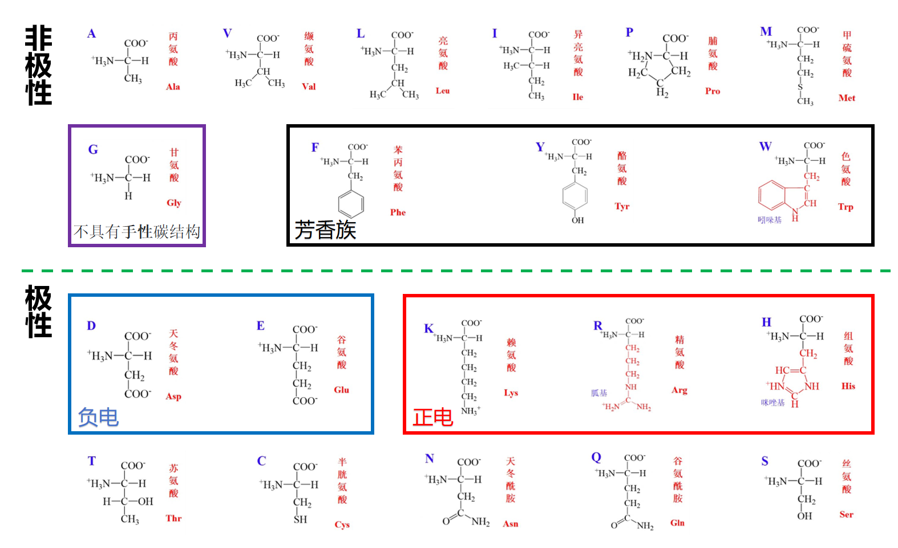
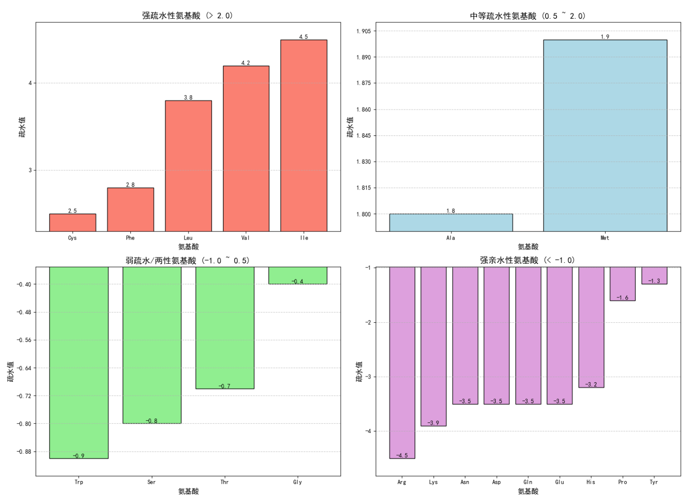

# 第二章 20 种标准氨基酸的特性与遗传编码

## 2.4 20 种氨基酸的物理特性
20 种标准蛋白质氨基酸的物理性质由侧链 R 基的结构直接决定，是影响肽链溶解性、折叠趋势、空间堆积及光谱特征的核心因素，也是结构蛋白质组学中进行序列分析、结构预测与蛋白表征的重要依据。

依据侧链的极性与疏水性，20 种氨基酸可划分为五大类：非极性脂肪族氨基酸（甘氨酸、丙氨酸、缬氨酸、亮氨酸、异亮氨酸、甲硫氨酸、脯氨酸）、非极性芳香族氨基酸（苯丙氨酸、酪氨酸、色氨酸）、极性中性氨基酸（丝氨酸、苏氨酸、半胱氨酸、天冬酰胺、谷氨酰胺）、酸性氨基酸（天冬氨酸、谷氨酸）、碱性氨基酸（赖氨酸、精氨酸、组氨酸）。这一分类是理解蛋白质疏水核心形成、表面亲水分布的基础。

在具体物理性质上，疏水性氨基酸倾向于分布在蛋白质内部以躲避水环境，形成稳定的疏水核心；亲水性氨基酸则多暴露于蛋白表面，提升溶解性。疏水性标度是定量描述氨基酸疏水程度的关键参数，直接用于蛋白折叠趋势与跨膜区域预测。

等电点（pI） 是氨基酸静电荷为零时的 pH 值，酸性氨基酸 pI 偏低，碱性氨基酸 pI 偏高，极性与非极性氨基酸 pI 则接近中性，其数值决定了氨基酸在不同 pH 体系中的带电状态与电泳行为。部分氨基酸具有特征紫外吸收，色氨酸（Trp）、酪氨酸（Tyr）在 280 nm 附近具有强吸收，是蛋白质光谱定量与结构监测的重要依据。

侧链的分子体积与空间位阻同样具有重要结构意义：甘氨酸侧链仅为氢原子，柔性极强；缬氨酸、异亮氨酸等支链氨基酸位阻大，会限制主链构象并影响蛋白内部的紧密堆积；脯氨酸的环状结构刚性最强，常引起肽链弯折，是蛋白质二级结构的重要调控单元。

## 2.5 20 种氨基酸的化学特性
氨基酸的化学性质由主链官能团与侧链活性基团共同决定，其解离行为与反应活性直接关联蛋白质的修饰、交联、催化与结合功能，是结构蛋白质组学解析翻译后修饰与活性位点的化学基础。

在解离特性方面，所有氨基酸均具有主链羧基与氨基的解离行为，而酸性、碱性及部分极性氨基酸的侧链还带有可解离基团，各自具有特征 pKa 值。侧链可解离基团是蛋白质静电相互作用、质子传递与催化活性的核心位点，其解离状态随环境 pH 发生变化，进而调控蛋白质结构与功能。

氨基酸可发生多种特征化学反应，这些反应也是蛋白质翻译后修饰的化学基础：氨基可发生酰化、甲基化、糖基化；羟基可发生磷酸化、羟基化；巯基可形成二硫键并参与氧化还原反应；芳香族侧链可发生卤化、硝化等修饰。

侧链的反应活性差异决定了其在蛋白质中的功能角色：半胱氨酸的巯基易形成二硫键以稳定结构；组氨酸咪唑基可作为质子供体与受体参与酶催化；赖氨酸侧链氨基是泛素化、乙酰化等修饰的核心位点；酸性氨基酸侧链羧基常参与配体结合与金属离子螯合。这些化学特性是理解蛋白功能位点、药物靶点设计的关键。

## 2.6 氨基酸侧链的结构与功能特性
侧链是氨基酸区分彼此的核心结构单元，其氢键能力、电荷、芳香性、柔性及空间特征，直接决定氨基酸在蛋白质结构与分子识别中的功能角色，是结构蛋白质组学研究相互作用界面的核心依据。

在氢键作用方面，侧链中的羟基、酰胺基、氨基、羧基等基团可作为氢键供体或受体，氢键数量与分布直接影响蛋白质二级结构稳定性、蛋白 - 蛋白及蛋白 - 配体相互作用的特异性。

电荷分布将氨基酸划分为带正电、负电、两性与中性四类。带电氨基酸是蛋白质表面静电环境、盐桥形成及离子结合的核心；中性氨基酸则更多承担结构填充、疏水作用与氢键支撑的角色，电荷分布模式也是预测蛋白可溶性与相互作用的重要指标。

侧链的芳香性、柔性与刚性具有显著结构意义：芳香族氨基酸可形成 π-π 堆积、阳离子 -π 相互作用；甘氨酸、丝氨酸等小分子侧链赋予主链高柔性；支链氨基酸与环状氨基酸（脯氨酸）则提升结构刚性，维持蛋白骨架稳定。

侧链结构还决定了氨基酸与配体、金属离子及核酸的结合潜力：组氨酸、半胱氨酸、酸性氨基酸常作为金属离子（Zn²⁺、Mg²⁺、Fe²⁺等）的配位位点；碱性氨基酸可通过静电作用与核酸磷酸骨架结合；极性与芳香族侧链则可通过氢键、疏水作用与小分子配体特异性结合，是结构蛋白质组学中识别活性中心与结合界面的关键依据。

## 2.7 遗传密码与氨基酸特性的关联
遗传密码是核酸序列与氨基酸序列的对应规则，其编码规律并非随机，而是与氨基酸理化性质高度关联，这种关联既体现了分子进化的保守性，也深刻影响蛋白质的结构与稳定性，是连接基因组信息与结构蛋白质组学的重要桥梁。

标准遗传密码表中，64 种密码子对应 20 种氨基酸与终止信号，每个氨基酸由 1 种或多种密码子编码。密码子与氨基酸的配对并非随机分布，而是呈现出显著的理化性质聚类特征。

密码子简并性是遗传密码的核心特征，通常同一氨基酸或理化性质相近的氨基酸由相近密码子编码，多数简并密码子仅第三位碱基不同。这种规律可降低突变对蛋白质结构与功能的破坏，而疏水性、极性、带电氨基酸的密码子使用偏好存在明显分区，进一步保证氨基酸性质的稳定遗传。

从进化关联来看，遗传密码的排布倾向于让理化性质相近的氨基酸在密码子空间中相邻，早期原始蛋白可能仅由少数简单氨基酸构成，随进化逐步引入结构更复杂、功能更多样的氨基酸，密码子系统也随之完善，使氨基酸性质与编码方式协同进化。

在结构蛋白质组学视角下，密码子使用偏好与蛋白质结构、稳定性、折叠速率密切相关：结构保守区域常使用最优密码子，保证氨基酸准确高效掺入；柔性区域与表面区域密码子偏好性较弱；而疏水核心、二级结构单元则对应特定的氨基酸编码偏好，这种序列 - 编码 - 结构的关联，为从基因组序列直接预测蛋白质结构特征提供了重要理论依据。

## 2.3 蛋白质中常见氨基酸的分类
在蛋白质结构和功能研究中，20种标准氨基酸可依据**侧链化学性质、疏水性及构象偏好**进行分类，这种分类为解析氨基酸在蛋白质中的作用提供了核心框架。

### 2.3.1 基于侧链化学性质的极性分类
该分类以侧链是否含极性基团、是否带电为核心标准，直接关联氨基酸的溶解性和分子间相互作用特性。

  
  
图2.2 氨基酸依据极性分类图

#### 1. 非极性脂肪族氨基酸
包括甘氨酸（Gly）、丙氨酸（Ala）、缬氨酸（Val）、亮氨酸（Leu）、异亮氨酸（Ile）、甲硫氨酸（Met）和脯氨酸（Pro）。  
侧链主要由碳氢元素构成，**缺乏极性基团**，整体呈疏水性，是蛋白质内部疏水核心的主要组成部分。其中脯氨酸因侧链与氨基形成环状结构，具有独特的构象限制作用。

#### 2. 芳香族氨基酸
包括苯丙氨酸（Phe）、酪氨酸（Tyr）和色氨酸（Trp）。  
侧链含芳香环（苯环、吲哚环），基础性质为疏水性；但酪氨酸的酚羟基、色氨酸的吲哚环可产生弱极性，使其能参与部分极性相互作用，且二者在280nm波长处有特征紫外吸收。

#### 3. 极性不带电氨基酸
包括丝氨酸（Ser）、苏氨酸（Thr）、半胱氨酸（Cys）、天冬酰胺（Asn）和谷氨酰胺（Gln）。  
侧链含极性基团（羟基、巯基、酰胺基），**不带净电荷**，可通过氢键与水分子或其他极性基团结合。半胱氨酸的巯基（-SH）易氧化形成二硫键，是维持蛋白质三级结构的关键。

#### 4. 带正电氨基酸（碱性）
包括赖氨酸（Lys）、精氨酸（Arg）和组氨酸（His）。  
侧链含可质子化的基团（氨基、胍基、咪唑基），在生理pH下带正电荷，能与带负电的分子（如核酸、酸性氨基酸侧链）形成离子键，常参与酶活性中心或分子识别过程。

#### 5. 带负电氨基酸（酸性）
包括天冬氨酸（Asp）和谷氨酸（Glu）。  
侧链含羧基，在生理pH下去质子化带负电荷，可与带正电的分子或金属离子结合，是蛋白质表面亲水性区域的重要组分，也常参与催化反应中的质子转移。

### 2.3.2 基于Kyte-Doolittle标度的疏水性分类
该分类通过量化疏水值（正为疏水，负为亲水），精准反映氨基酸在水-有机溶剂体系中的分配行为，是预测蛋白质跨膜区、表面暴露区域的核心依据。

  
  
图2.3 氨基酸依据疏水性分类图

#### 1. 强疏水性氨基酸
包括异亮氨酸（Ile，4.5）、缬氨酸（Val，4.2）、亮氨酸（Leu，3.8）、苯丙氨酸（Phe，2.8）和半胱氨酸（Cys，2.5）。  
疏水值 > 2.0，侧链疏水性极强，倾向于避开水环境，主要聚集在蛋白质内部或跨膜蛋白的磷脂双分子层嵌入区。这些氨基酸在蛋白质的疏水核心中起到稳定结构的作用，例如在膜蛋白中，它们帮助蛋白质嵌入磷脂双分子层中。

#### 2. 中等疏水性氨基酸
包括甲硫氨酸（Met，1.9）和丙氨酸（Ala，1.8）。  
疏水值介于 0.5 和 2.0 之间，疏水性中等，可存在于蛋白质表面与内部的过渡区域。这些氨基酸在蛋白质的表面和内部之间起到过渡作用，例如在蛋白质的折叠过程中，它们可以帮助稳定中间状态。

#### 3. 弱疏水/两亲性氨基酸
包括甘氨酸（Gly，-0.4）、苏氨酸（Thr，-0.7）、丝氨酸（Ser，-0.8）和色氨酸（Trp，-0.9）。  
侧链含极性基团（羟基、巯基），具有一定亲水性，同时也有一定的疏水性，因此表现出两亲性。这些氨基酸可以与水分子或其他极性基团相互作用，常位于蛋白质的近表面区域，参与氢键网络的构建。

#### 4. 强亲水性氨基酸
包括酪氨酸（Tyr，-1.3）、天冬酰胺（Asn，-3.5）、谷氨酰胺（Gln，-3.5）、天冬氨酸（Asp，-3.5）、谷氨酸（Glu，-3.5）、赖氨酸（Lys，-3.9）和精氨酸（Arg，-4.5）。  
疏水值 < -1.0，侧链亲水性极强，含酰胺基或带电基团，可通过氢键或离子键与水紧密结合，几乎全部暴露于蛋白质表面，是分子间相互作用的关键位点。这些氨基酸在蛋白质的表面起到关键作用，例如在蛋白质-蛋白质相互作用中，它们可以通过离子键和氢键与其它蛋白质相互作用。

### 2.3.3 基于蛋白质构象偏好的特殊分类
该分类基于氨基酸对蛋白质二级结构（螺旋、折叠、转角）的形成倾向，直接关联蛋白质三维结构的稳定性和构象特征。

#### 表 2.2 氨基酸的蛋白质构象形成倾向
| 构象类型       | 较高倾向的氨基酸       | 较低倾向的氨基酸       | 核心影响逻辑                     |
|----------------|------------------------|------------------------|----------------------------------|
| 螺旋形成倾向   | Glu、Met、Ala、Leu     | Pro、Gly、Tyr、Ser     | 侧链与 α-螺旋的几何/氢键兼容性     |
| 折叠形成倾向   | Val、Ile、Thr、Tyr     | Glu、Gln、Lys、Ala     | 侧链与 β-折叠片层的空间/疏水匹配度 |
| 转角形成倾向   | Asn、Gly、Pro、Ser     | Val、Ile、Leu          | 侧链对转角“紧凑+柔性”构象的适应性 |

不同二级结构的几何特征（如螺旋螺距、折叠片层间距、转角构象转折程度），对氨基酸侧链提出了特定要求：
- **α-螺旋**：Glu、Met 等侧链的大小、形状与 α-螺旋“3.6 残基/圈”的螺距匹配，能稳定螺旋内的氢键网络；Pro 的环状侧链会破坏螺旋氢键的连续性，Gly 因无侧链导致构象过度灵活，难以维持螺旋刚性。
- **β-折叠**：Val、Ile 等疏水且空间匹配的侧链，可通过疏水堆积增强 β-片层稳定性；Glu、Lys 等极性侧链会干扰片层间疏水作用，Ala 因侧链过小，无法为片层堆积提供足够空间支撑。
- **转角**：Gly 的小侧链（仅 H 原子）、Pro 的环状结构，能适应转角的急剧构象变化；Asn、Ser 的极性基团可通过氢键稳定转角局部结构；Val、Ile 等大体积疏水侧链因空间位阻，难以嵌入转角紧凑区域。

这种构象倾向是蛋白质折叠“自发寻找能量最优结构”的分子基础，也为蛋白质工程中通过氨基酸突变调控结构提供了理论依据。
